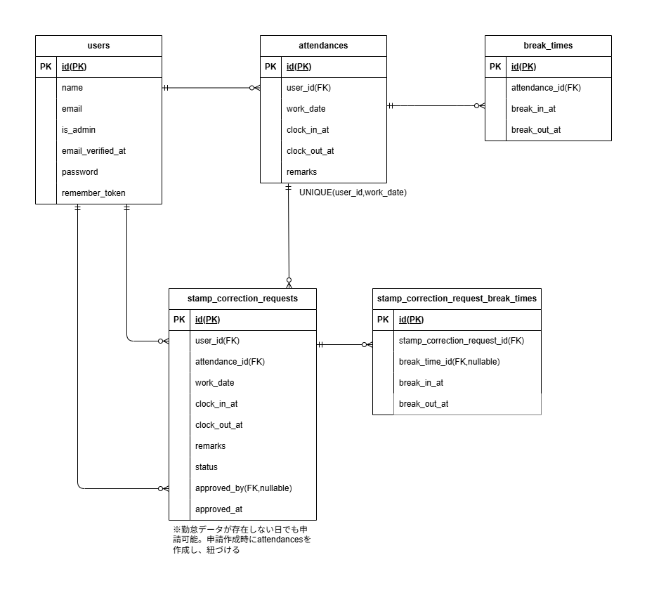

# COACHTECH 勤怠管理アプリ

## 概要

Laravel と Docker を用いて開発した勤怠管理アプリです。
ユーザー登録、メール認証、勤怠の打刻（出勤・休憩開始/終了・退勤）、打刻修正申請・承認などの基本機能を備えています。
一般ユーザーと管理者で利用できる機能が異なります。

## 環境構築

**Docker ビルド**

1.リポジトリのクローン

```bash
git clone https://github.com/nishidanamiki/attendance-app.git
cd attendance-app
```

2.DockerDesktop アプリを立ち上げる  
3.`docker compose up -d --build`

> _Mac の M1・M2 チップの PC の場合、`no matching manifest for linux/arm64/v8 in the manifest list entries`のメッセージが表示されビルドができないことがあります。
> エラーが発生する場合は、docker-compose.yml ファイルの「mysql」内に「platform」の項目を追加で記載してください_

```yaml
mysql:
  platform: linux/x86_64 # ← この文を追加
  image: mysql:8.0.26
  environment:
```

**Laravel 環境構築**

1.`docker compose exec php bash`  
2.`composer install`  
3.「.env.example」ファイルをコピーし「.env」ファイルを作成

```bash
cp .env.example .env
```

4..env に以下の環境変数を追加

```text
DB_CONNECTION=mysql
DB_HOST=mysql
DB_PORT=3306
DB_DATABASE=laravel_db
DB_USERNAME=laravel_user
DB_PASSWORD=laravel_pass

MAIL_MAILER=smtp
MAIL_HOST=mailhog
MAIL_PORT=1025
MAIL_USERNAME=null
MAIL_PASSWORD=null
MAIL_ENCRYPTION=null
MAIL_FROM_ADDRESS="no-reply@coachtech-attendance.local"
MAIL_FROM_NAME="COACHTECH勤怠管理アプリ"
```

5.アプリケーションキーの作成

```bash
php artisan key:generate
```

6.マイグレーションの実行

```bash
php artisan migrate
```

7.シーディングの実行

```bash
php artisan db:seed
```

### 初期ログイン情報

Seederにより以下のユーザーが作成されます。

#### 管理者ユーザー

- email : admin@example.com
- password : password

#### スタッフユーザー

- staff1@example.com / password
- staff2@example.com / password
  ※すべてメール認証済み状態で作成されます。

## ログインURL

- 一般ユーザー: http://localhost/login
- 管理者: http://localhost/admin/login

## テスト環境の準備

1. `.env.testing`を作成。

```bash
cp .env .env.testing
```

テスト用 DB 名を設定(.env.testing 内)

```env
APP_ENV=testing
APP_DEBUG=true

DB_CONNECTION=mysql
DB_HOST=mysql
DB_PORT=3306
DB_DATABASE=demo_test
DB_USERNAME=root
DB_PASSWORD=root

CACHE_DRIVER=array
SESSION_DRIVER=array
QUEUE_CONNECTION=sync
MAIL_MAILER=log
```

2.テスト用データベースを作成

```bash
docker compose exec mysql mysql -uroot -proot -e "CREATE DATABASE IF NOT EXISTS demo_test;"
```

3.テスト用マイグレーション

```bash
php artisan migrate --env=testing
```

4.テスト実行

```bash
php artisan test
```

## 使用技術（実行環境）

- PHP 8.1.33
- Laravel 10.50.0
- MySQL 8.0.26
- Nginx 1.21.1
- MailHog 1.0.1

## ER 図



## URL

- 開発環境: http://localhost/
- phpMyAdmin: http://localhost:8080/
- MailHog: http://localhost:8025

## 使用素材

- アイコン：ICOOON MONO
  https://icooon-mono.com/
